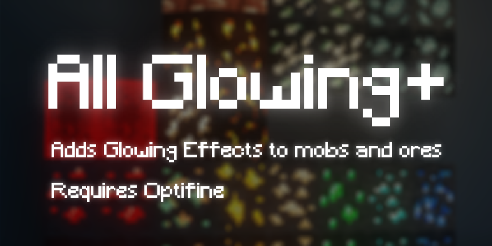

 
 
 
 
 
 
 
 
 
 
 
 

# Requires [Optifine](https://www.optifine.net/downloads)
# 2.0

+ Added Galosphere Support (Blocks & Mobs)
+ Added Biomes O Plenty (Blocks)
+ Waystones (Warp Plate Fix)
+ Added some Cataclysm (Blocks)
+ Added Quark Corundum

Some Fixed Textures
# _Feel free to use. I would appreciate if you refer me to reupload it...._
